# ❤️ 한서대 축제 한정 인연 매칭 앱 "너랑 나랑" 

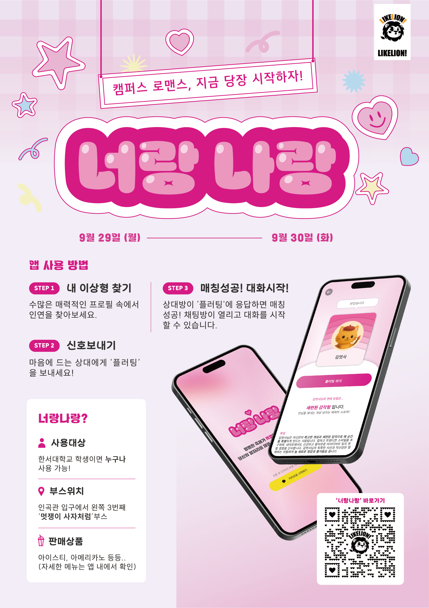

 

## 프로젝트 소개 
- 기획 배경 :**2025년 한서대학교 축제** 동안 학생들의 참여를 독려하고 즐길 거리를 제공하기 위해 기획되었습니다.
  
- **멋쟁이사자처럼**동아리에서 기획하였으며, **온라인 매칭 앱**을 중심으로 운영하며, **오프라인 부스에서 음료 및 전용 쿠폰**을 증정하는 이벤트를 병행하여 **온·오프라인 전반에서 앱 사용을 활성화**하였습니다.

- 새로운 만남에 대한 심리적 장벽을 낮추고, IT 기술을 활용한 **참여형 축제 문화**를 조성하였습니다. 

 

## 1. My Role & Strategy
- **프로젝트 총괄 및 행사 총괄(PM)** : 아이디어 빌딩, 팀원 모집, 운영까지의 전체 라이프사이클 리딩
  
- **온·오프라인 연계 전략 수립** : 온라인 매칭 서비스에 그치지 않고, 축제 부스(오프라인)와 연계하여 사용자 유입 및 리텐션을 확보하는 O4O(Online for Offline) 전략 기획
  
- **유저 시나리오 설계** : 학우들의 심리적 장벽을 낮추기 위해 익명성 보장 및 자신의 이상형 테스트 를 가미한 매칭 알고리즘 가이드라인 제시
  
- **리스크 관리** : 축제 기간 단기 집중되는 트래픽에 대비한 운영 프로세스 정립 및 CS 대응
  
 

## 2. 핵심기능

- **인연 매칭 시스템**: 학과, 학번, 관심사 등을 기반으로 한 맞춤형 인연 추천 및 매칭 기능.

- **실시간 채팅/쪽지**: 매칭된 상대와 소통할 수 있는 실시간 인터랙션 기능.

- **오프라인 쿠폰 연동**: 매칭 성공 시 부스에서 사용 가능한 음료 및 이벤트 쿠폰 발급 시스템.

- **실시간 대시보드**: 축제 현황 및 매칭 현황을 시각화하여 사용자들의 참여 동기 부여.

 

## 4. 기술 스택 및 협업 도구

- Design: Figma (와이어프레임 및 UI/UX 설계)

- Communication & Management: Notion (기획서 및 일정 관리), Slack/Discord (실시간 소통)

- Development Context: * Frontend: React (또는 사용한 프레임워크)

- Backend: Spring Boot 

- Collaboration: GitHub (Issue, PR 기반 협업)

 

## 5. 성과 및 회고

- 주요 성과: 

- **축제 기간 내 누적 사용자 수 1300명 달성, 축제 화제성 1위**

- **오프라인 부스 음료 전 품목 매진**

- **교내 신문 보도**

<table>
  <tr>
    <td align="center">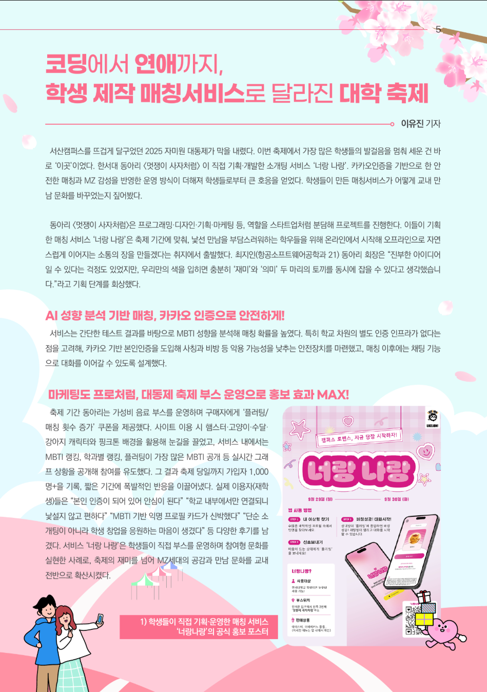 </td>
    <td align="center">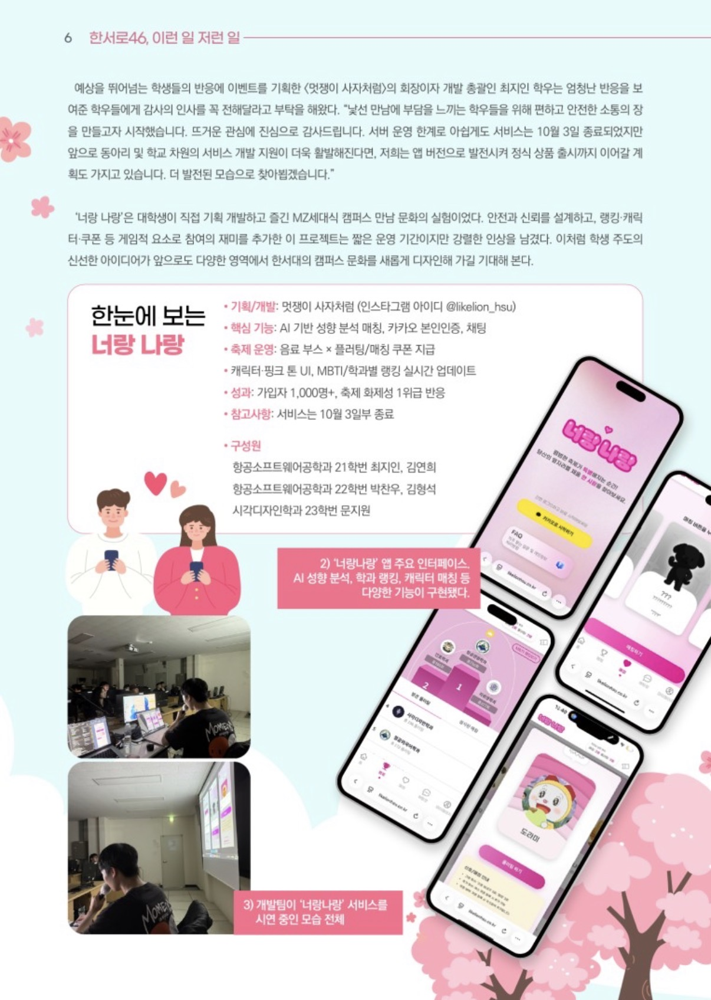 </td>
  </tr>
</table>

 

## 6. 페이지 구성요소

### [초기화면]

| 초기화면 |
|----------|
|

 

### [내 정보 입력]

| 내 정보 입력 |
|----------|
<table>
    <tr><td align="center">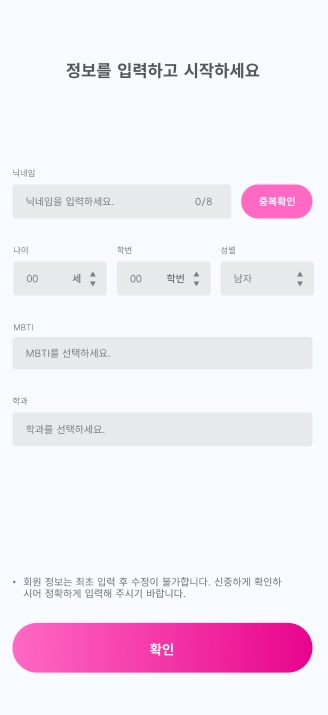 </td></tr>
  <tr>
    <td align="center">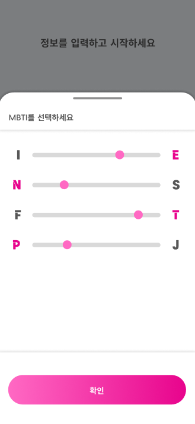 </td>
    <td align="center">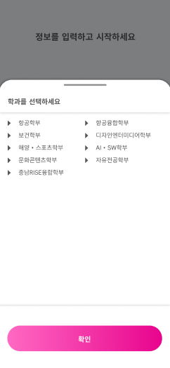 </td>
  </tr>
</table>

 

### [이상형 테스트]

| 이상형 테스트 |
|----------|
|

 

### [테스트 결과]

| 테스트 결과 |
|----------|
<table>
  <tr>
    <td align="center">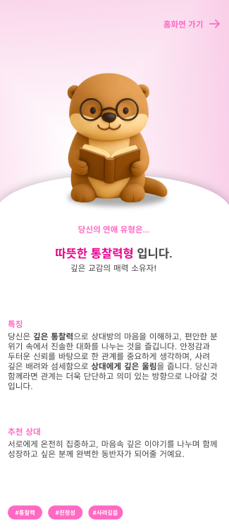 </td>
    <td align="center">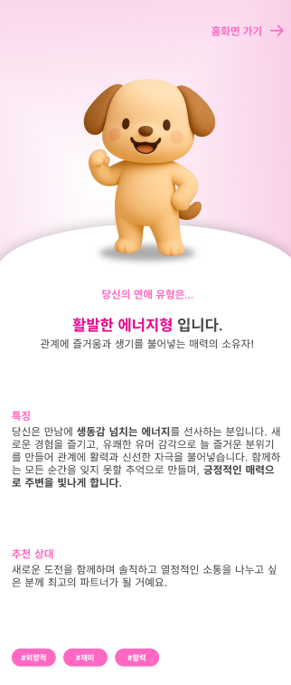 </td>
  </tr>
  <tr>
    <td align="center">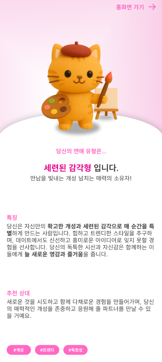 </td>
    <td align="center">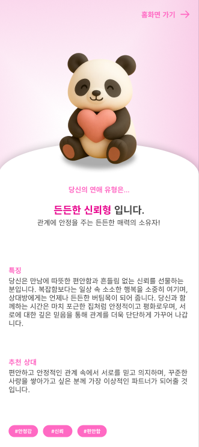 </td>
  </tr>
</table>

 

### [메인 화면]

| 메인 화면 |
|----------|
<table>
  <tr>
    <td align="center">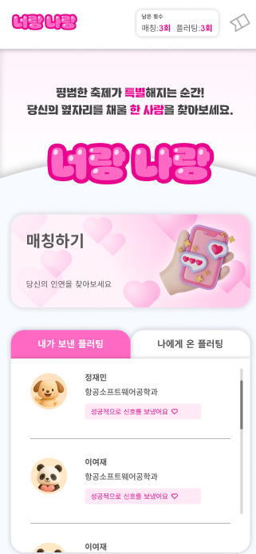 </td>
  </tr>
  <tr>
    <td align="center">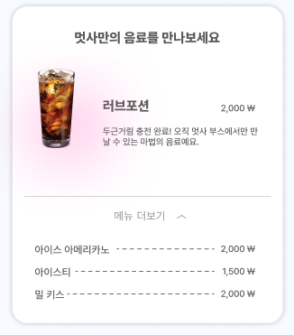 </td>
  </tr>
  <tr>
    <td align="center">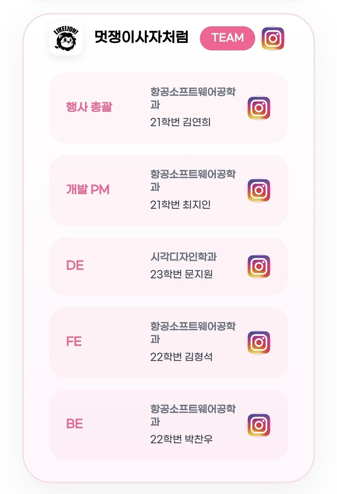 </td>
  </tr>
  <tr>
    <td align="center">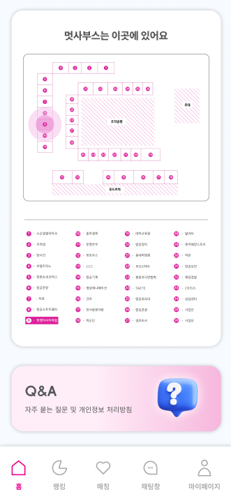 </td>
  </tr>
</table>